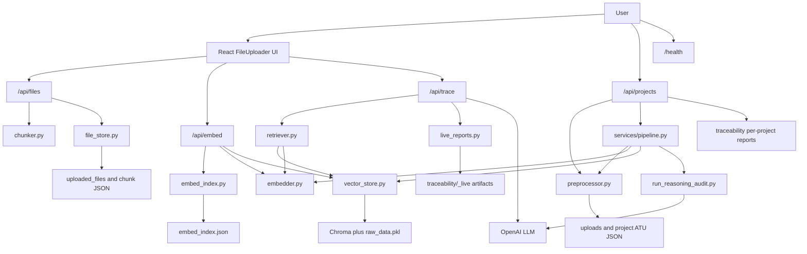
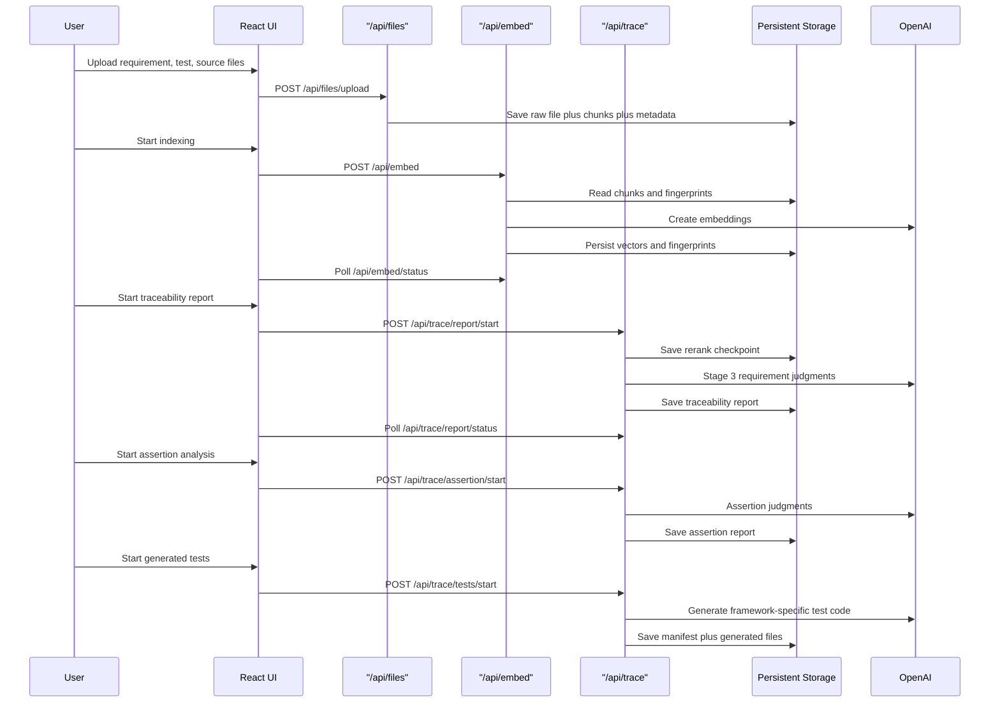

# Implementation Guide

This document explains how the current system is implemented in the repository and how the major parts integrate.

## Scope

The implemented system in this repository consists of:

- a React frontend mounted from `src/App.tsx`
- a shipped `FileUploader` UI in `src/FileUploader.tsx`
- a project-scoped backend pipeline exposed through `/api/projects`
- a corpus-wide backend workflow exposed through `/api/files`, `/api/embed`, and `/api/trace`
- a liveness endpoint exposed through `/health`
- chunking, ATU extraction, embedding, retrieval, traceability, assertion analysis, generated-test output, and report export

## High-Level Architecture

## Current Frontend Implementation

### Entry point

- `src/main.tsx` bootstraps React and renders `App`.
- `src/App.tsx` mounts `FileUploader` directly.
- The shipped UI path is centered on file upload, indexing, and analysis.

### Main UI responsibilities in `src/FileUploader.tsx`

`FileUploader.tsx` is the main frontend controller. It is not just a visual upload widget. It holds most of the client orchestration logic for the shipped frontend path:

- upload state
- local project and theme state
- backend connectivity state
- file list restoration from the backend
- transition from upload view to pipeline view
- polling for embedding, traceability, assertion, and generated-test jobs
- download and clear actions for saved artifacts

The component is split into two major views:

1. Upload view
   - lets the user upload requirement, test, and source files
   - shows counts, chunk counts, online/offline state, and re-chunk actions

2. Pipeline view
   - rendered by the internal `EmbedPanel`
   - manages indexing, report generation, assertion analysis, and test generation

### File state and restore behavior

On startup, the frontend calls `GET /api/files` and reconstructs the current corpus into three buckets:

- `requirement`
- `test`
- `source`

This is important because the backend is the source of truth for uploaded files. The frontend only mirrors that state after fetch.

### Upload flow

When a user uploads a file:

1. The UI creates a temporary placeholder row.
2. It sends a `FormData` request to `POST /api/files/upload`.
3. The backend saves the raw file, chunks it immediately, stores chunk metadata, and returns the persisted file record.
4. The placeholder row is replaced with the real server response.

This gives the UI optimistic feedback while still making the backend authoritative.

### Local-only project state

The current `FileUploader` UI also keeps a `projects` list and `activeProjectId` in `localStorage`:

- `fu_projects`
- `fu_active_project`

This project state is currently UI-only. It does not scope backend uploads, embeddings, or reports. Uploads are sent without a project identifier, and the backend corpus used by `/api/files`, `/api/embed`, and `/api/trace` is global.

That means the current implementation of the `FileUploader` path behaves as a single shared corpus, even though the UI presents project-like organization locally.

### Re-chunk flow

The upload view also exposes a re-chunk action:

1. The frontend calls `POST /api/files/rechunk`.
2. The backend re-reads raw stored files from disk.
3. It re-runs chunking with the current chunking configuration.
4. The UI refreshes `GET /api/files` so chunk counts stay in sync.

This is useful after chunker changes or failed chunk extraction.

### Pipeline view in `EmbedPanel`

`EmbedPanel` is effectively the frontend control room for the rest of the system. It manages:

- embedding status polling from `GET /api/embed/status`
- traceability report polling from `GET /api/trace/report/status`
- assertion report polling from `GET /api/trace/assertion/status`
- generated tests polling from `GET /api/trace/tests/status`
- download and clear actions for each saved artifact
- expansion of requirement-level traceability details returned by `/api/trace/report/view`

Each long-running backend action is started once and then observed through polling. The frontend never blocks on a single long HTTP request for the whole pipeline.

### Backend-supported project workflow

The backend also exposes a separate project-scoped workflow under `/api/projects`.

That workflow is implemented and mounted by FastAPI, but it is not the path used by `src/App.tsx`. It is designed for multipart project submission and full pipeline execution in one backend-driven flow.

## Backend Application Shell

### `backend/main.py`

`backend/main.py` is intentionally thin:

- creates the FastAPI app
- enables permissive CORS
- mounts the routers

The mounted routers are:

- `/health`
- `/api/files`
- `/api/projects`
- `/api/embed`
- `/api/trace`

Business logic is delegated to routers and services.

### `backend/config.py`

`config.py` centralizes filesystem layout and model names. The main directories touched by the implemented flows are:

| Path group | Purpose |
| --- | --- |
| `UPLOAD_ROOT` | project-scoped raw uploads for `/api/projects` |
| `PROJECT_ROOT` | project-scoped ATU JSON written by Phase 1 |
| `TRACEABILITY_ROOT` | report outputs and live artifacts |
| `FILES_ROOT` | flat upload store used by `/api/files` |
| `CHUNKS_ROOT` | per-file chunk JSON store used by `/api/files` |
| `FILES_META` | file metadata index used by `/api/files` |

It also loads environment variables and defines:

- `EMBEDDING_MODEL`
- `LLM_MODEL`

### `/health`

`backend/routers/health.py` provides a simple liveness endpoint.

`GET /health` returns:

- service status
- a human-readable message
- the project upload root path
- a UTC timestamp

## LangChain Usage

LangChain is part of the implemented system, but it is used as an infrastructure layer rather than as the top-level application framework.

The current code uses LangChain in four concrete ways:

1. `langchain-text-splitters`
   - used in `backend/chunker.py`
   - provides `RecursiveCharacterTextSplitter`
   - provides the `Language` enum used for extension-aware source and test splitting

2. `langchain-openai`
   - used in `backend/services/embedder.py`
   - provides `OpenAIEmbeddings`
   - handles embedding batching and request plumbing for both corpus chunks and query embeddings

3. `langchain-community`
   - used in `backend/services/retriever.py`
   - provides the `FlashrankRerank` wrapper around the FlashRank reranker
   - used for Stage 2 reranking after dense recall

4. `langchain-core`
   - used in `backend/services/retriever.py`, `backend/scripts/run_reasoning_audit.py`, and the retriever adapter in `backend/services/vector_store.py`
   - provides `Document` objects that wrap candidate text and metadata before reranking or adapter-based retrieval

So LangChain is present in the implementation, but mainly as a library layer for:

- text splitting
- embedding client abstraction
- reranker integration
- document container types

It is not being used here for agent orchestration, chains, or prompt templating as the main application structure.

## Corpus-Wide File Ingestion Implementation

### `/api/files` router

`backend/routers/files.py` is the ingestion API used by the frontend.

It provides:

- `POST /api/files/upload`
- `GET /api/files`
- `GET /api/files/{file_id}`
- `DELETE /api/files/{file_id}`
- `POST /api/files/rechunk`

### What happens during upload

When `POST /api/files/upload` is called:

1. category is validated against `requirement`, `test`, or `source`
2. file bytes are read into memory
3. a UUID-backed file id is generated
4. raw bytes are saved into `backend/uploaded_files`
5. the file is chunked immediately through `chunker.chunk_bytes(...)`
6. chunk JSON is written into `backend/uploaded_files/chunks/{file_id}.json`
7. metadata is written into `backend/uploaded_files/files_meta.json`
8. live trace artifacts are invalidated, because the underlying corpus changed

The invalidation step is important. It prevents traceability, assertion, and generated-test outputs from silently looking fresh after the corpus has changed.

### `file_store.py`

`backend/services/file_store.py` is the persistence layer for the upload flow.

Its responsibilities are intentionally narrow:

- load and save `files_meta.json`
- load and save per-file chunk JSON
- remove file records and chunk records

It does not know anything about FastAPI, embeddings, or traceability.

## Project-Scoped Pipeline Implementation

### `/api/projects` router

`backend/routers/projects.py` implements a project-scoped pipeline API.

It provides:

- `POST /api/projects/start`
- `GET /api/projects`
- `GET /api/projects/{project_id}/files`
- `GET /api/projects/{project_id}/atus`
- `GET /api/projects/{project_id}/report`
- `GET /api/projects/{project_id}/report/csv`
- `DELETE /api/projects/{project_id}`

### What happens during `POST /api/projects/start`

When a project start request is sent:

1. the backend reads multipart form data
2. it expects `projectName` and `projectId`
3. uploaded files are classified by field name prefix such as `requirement`, `test`, or `code`
4. files are saved into `backend/uploads/{project_id}`
5. Phase 1 runs through `services.pipeline.run_phase1(...)`
6. the Phase 1 output is written both to:
   - `backend/uploads/{project_id}/phase1_atus.json`
   - `backend/projects/{project_id}/atus.json`
7. Phase 2 runs through `services.pipeline.run_phase2(...)`
8. Phase 3 runs through `services.pipeline.run_phase3(...)` when Phase 2 succeeds
9. a markdown project report is written under `backend/traceability/{project_id}/traceability_report.md`
10. a structured response is returned with upload stats, pipeline summaries, and report metadata

This route is a full backend-managed pipeline, unlike the `FileUploader` flow where upload, embedding, and analysis are separate user-triggered stages.

### Phase 1 implementation with `preprocessor.py`

`backend/preprocessor.py` is the ATU extractor used by the project-scoped pipeline.

Its extraction strategy is different from `chunker.py`:

- requirement files are split by numbered items, paragraphs, or lines
- Python test and source files use AST extraction
- non-Python code uses fixed-stride overlapping line chunks
- PDF files are processed page by page when `pypdf` is available

The output is a `PipelineResult` with:

- `requirements`
- `tests`
- `sources`
- `warnings`

### Phase 2 implementation with `sync_project_index.py`

Phase 2 reads `backend/projects/{project_id}/atus.json`, embeds all ATUs, and inserts them into the shared vector store with project metadata.

Important integration details:

- vectors are stored in the same shared Chroma-backed store used by the corpus-wide flow
- metadata includes `project_id`, so project-scoped vectors can be removed on re-run or deletion
- the returned summary is folded into the `/api/projects/start` response

### Phase 3 implementation with `run_reasoning_audit.py`

Phase 3 runs requirement-level reasoning over the project-scoped indexed ATUs.

It:

1. retrieves candidate tests and sources for each requirement
2. asks the LLM for traceability judgments
3. writes `traceability_matrix.json` under `backend/traceability/{project_id}`
4. feeds that output into the markdown and CSV project report exports exposed by `/api/projects`

### Project lifecycle routes

The remaining `/api/projects` routes support:

- listing saved projects from `backend/uploads`
- inspecting saved files for one project
- downloading Phase 1 ATU JSON
- downloading the generated markdown report
- downloading a CSV representation of the traceability report
- deleting the project’s saved uploads, ATU state, and generated traceability artifacts

## Chunking Implementation

### `backend/chunker.py`

`chunker.py` is the splitter used by the corpus-wide `/api/files` upload flow.

It is built on LangChain's `RecursiveCharacterTextSplitter` from `langchain-text-splitters`.

Chunking is category-aware:

| Category | chunk_size | chunk_overlap | Intent |
| --- | --- | --- | --- |
| `requirement` | 500 | 50 | clause-level precision |
| `test` | 800 | 50 | preserve test bodies |
| `source` | 1200 | 150 | preserve implementation context |

### Category-specific behavior

1. Requirement files
   - treated as prose
   - split with prose-oriented separators
   - table-aware handling keeps structured tables more intact

2. Test files
   - use language-aware separators when the extension is recognized
   - try to preserve natural code boundaries such as test functions or blocks
   - apply overlap cleanup to avoid tiny trailing artifacts

3. Source files
   - use language-aware separators for implementation-oriented structure
   - aim to preserve function, class, or module-level context

### Language and extension handling

`backend/chunking_constants.py` maps extensions to LangChain language profiles for:

- C and headers
- C++
- Python
- Java
- JavaScript
- TypeScript
- Go
- Rust
- Ruby
- Kotlin
- Swift

This gives test and source chunking different separator sets depending on the language.

### Important limitation in the upload flow

The upload route calls `chunk_bytes(...)`, and `chunk_bytes(...)` simply decodes raw bytes as UTF-8 with replacement before chunking.

That means:

- plain text and source files work as expected
- PDF parsing is not special in the current `FileUploader` flow
- binary office formats such as `.docx` are not truly parsed into text in this path

Even though `.docx` and similar extensions appear in prose extension lists and UI hints, the current ingestion path does not perform real document extraction for them.

## Embedding and Indexing Implementation

### `/api/embed` router

`backend/routers/embed.py` manages the embedding lifecycle for the uploaded corpus.

It provides:

- `POST /api/embed`
- `GET /api/embed/status`
- `POST /api/embed/search`
- `DELETE /api/embed`
- `POST /api/embed/purge`
- `DELETE /api/embed/{file_id}`

### Change detection with `embed_index.py`

Incremental embedding is driven by `backend/services/embed_index.py`.

This file stores a fingerprint record per uploaded file:

- `content_hash`
- `embedded_at`
- `chunk_count`

Before an embed run starts, the backend compares the current upload metadata against the fingerprint index and classifies files into:

- `new`
- `modified`
- `deleted`
- `unchanged`

This prevents needless re-embedding when files have not changed.

### Embedding execution

`backend/services/embedder.py` wraps `langchain-openai`'s `OpenAIEmbeddings`.

Important design details:

- the client is cached once per process
- `embed_texts(...)` is used for chunk batches
- `embed_single(...)` is used for individual query embeddings
- empty strings are replaced before sending to the embedding API

### Vector store design

`backend/services/vector_store.py` implements the corpus index.

It uses a dense-vector design with a persistence sidecar:

- dense store: Chroma persistent collection
- durable sidecar: `raw_data.pkl` stores text, vectors, and metadata so Chroma can be rehydrated and local stats and chunk iteration can be restored quickly

This means the system keeps:

1. semantic retrieval capability through embeddings
2. a local persisted mirror of indexed content for recovery and runtime metadata access

### Index mutation flow

For a new or modified file:

1. chunk text is loaded from `file_store`
2. chunk texts are embedded through OpenAI
3. metadata is assembled per chunk
4. vectors and metadata are inserted into Chroma
5. `_raw_data` is updated
6. the file fingerprint is updated in `embed_index.json`

For a deleted file:

1. vectors are removed from Chroma by `file_id`
2. `_raw_data` is filtered
3. the file fingerprint is removed

### Embed job model

The embed router keeps an in-memory `_job` object for progress tracking. The frontend polls this job to display:

- running state
- current phase
- completed count
- last processed file
- diff preview

The phases are:

1. delete vectors for removed files
2. re-embed modified files
3. embed new files

## Retrieval and Traceability Implementation

### `/api/trace` router

`backend/routers/trace.py` is the most orchestration-heavy part of the backend.

It handles:

- raw recall and rerank inspection endpoints
- traceability report generation
- assertion analysis
- generated test creation
- downloads and clearing of saved artifacts

### Persistent live artifacts

The corpus-wide analysis flow persists its outputs under `backend/traceability/_live`:

| Artifact | Purpose |
| --- | --- |
| `rerank_report.json` | saved Stage 2 retrieval and rerank artifact |
| `traceability_report.json` | saved Stage 3 requirement-level traceability report |
| `assertion_input_report.json` | saved assertion job input snapshot |
| `assertion_report.json` | saved assertion analysis output |
| `generated_tests_manifest.json` | generated test manifest |
| `generated_tests/` | generated code files |

This makes the report flow restart-safe and lets later stages depend on earlier saved artifacts rather than forcing everything into one single transaction.

## Retrieval Pipeline Details

### `backend/services/retriever.py`

The corpus-wide retrieval pipeline is implemented in `retriever.py`.

It runs in multiple stages:

1. Stage 1: dense recall
   - embed the requirement text
   - search the vector store for `test` candidates
   - search the vector store for `source` candidates

2. Stage 1.5: pre-diversification
   - `greedy_diversify(...)` limits how many chunks from the same file proceed to reranking
   - this reduces domination by a single large test or source file

3. Stage 2: FlashRank reranking
   - implemented through LangChain's `FlashrankRerank` wrapper from `langchain-community`
   - candidates are re-scored with `ms-marco-MiniLM-L-12-v2`
   - tests and source chunks are reranked separately

4. Stage 2.5: dynamic final cut and safeguard
   - `resolve_top_k_final(...)` adjusts the final slice size based on score quality
   - `apply_test_safeguard(...)` can re-promote strong Stage 1 test hits that would otherwise disappear after reranking

This is a strong design choice because it keeps dense recall broad enough for coverage while using reranking and safeguards to avoid brittle false negatives.

Internally, candidate chunks are wrapped as LangChain `Document` objects before they are passed to the reranker.

## Traceability Report Job

### Stage 2 artifact generation

When `POST /api/trace/report/start` is called, `_run_report_job(...)` performs:

1. validation that the index exists and contains requirement vectors
2. optional resume loading from prior saved rerank or traceability artifacts
3. batch embedding for missing requirement chunks
4. Stage 1 recall and Stage 2 rerank for each requirement
5. checkpoint save into `rerank_report.json`

The key integration detail is that Stage 2 is checkpointed before Stage 3 LLM judgment starts.

### Stage 3 LLM judgment

After rerank data exists, `_run_stage3(...)` and `_run_stage3_requirement(...)` perform requirement-level LLM auditing:

1. load reranked test candidates and supporting source candidates
2. send a structured prompt to the OpenAI LLM
3. ask for:
   - candidate test judgments
   - verified tests
   - implemented-by evidence
   - gap analysis
   - final verdict
4. store the result back onto the requirement entry
5. checkpoint progress into `traceability_report.json`

The job is concurrent and controlled by `TRACE_STAGE3_MAX_CONCURRENCY`.

### Resume behavior

The traceability job supports resumption:

- completed requirements can be reused from saved checkpoints
- failed requirements can be retried
- rerank-only data can be reused when the user asks for Stage 3 rerun from a saved rerank artifact

This is one of the most important implementation features because Stage 3 is the most expensive part of the report-generation pipeline.

## Assertion Analysis Implementation

The assertion stage depends on a saved traceability report.

When `POST /api/trace/assertion/start` is called:

1. the backend verifies traceability exists and is complete
2. it builds or reuses an assertion input snapshot
3. it runs `_run_assertion_job(...)`
4. each requirement is evaluated by `_run_assertion_requirement(...)`
5. the LLM analyzes whether linked tests contain direct, partial, weak, or missing assertion evidence
6. rows are flattened and saved into `assertion_report.json`

This stage converts trace-linked evidence into a more focused "how strong is the assertion evidence?" report.

## Generated Tests Implementation

The generated tests stage depends on both:

- a saved traceability report
- a fresh saved assertion report

When `POST /api/trace/tests/start` is called:

1. the backend verifies assertion freshness against traceability
2. `_collect_generation_clusters(...)` groups gaps into generation units
3. `_detect_cluster_framework(...)` inspects existing ecosystem evidence to infer framework and language
4. a preferred test function name is derived
5. `_run_generated_tests_cluster(...)` asks the LLM to create framework-specific tests
6. generated functions are normalized and optionally renamed to the preferred identifier
7. `_render_generated_file(...)` assembles the final file content
8. files are saved under `traceability/_live/generated_tests`
9. manifest metadata is written to `generated_tests_manifest.json`

This stage is not generating tests blindly. It tries to use:

- assertion gap context
- traceability report context
- verified test exemplars
- supporting source snippets

That makes generated output more grounded in the repository's current evidence.

## Saved Status and UI-Friendly Views

### `live_reports.py`

`backend/services/live_reports.py` is the shared persistence and reshaping layer for the corpus-wide report artifacts.

It is responsible for:

- saving and loading report JSON files atomically
- clearing related downstream artifacts when upstream data changes
- building traceability summaries for the UI
- flattening grouped report data into row-based exports
- computing freshness and completeness status for assertion and generated-test outputs

This service is what allows the frontend to show both:

1. lightweight saved-status cards
2. expanded requirement-level traceability detail views

without duplicating report-shaping logic in the client.

## End-to-End FileUploader Flow

## Important Implementation Notes

These are not theoretical concerns. They are part of the current implementation and should be understood by anyone maintaining the project.

### 1. Frontend "projects" are local-only

The upload and analysis flow is corpus-wide. The UI's `projects` list in `FileUploader.tsx` is not enforced on the backend.

### 2. Report request tuning fields are not currently used

The frontend sends `top_k_recall` and `top_k_final` when starting the report, but `ReportRequest` in `backend/routers/trace.py` only accepts `reuse_saved_rerank`.

So the actual retrieval settings come from backend `RETRIEVAL_PARAMS`, not from the current frontend payload.

### 3. Semantic search is only partially wired in the frontend

`EmbedPanel` contains `runSearch()` and `results` state, but the `query` state has no setter and there is no active input wiring for search in the current component. The backend endpoint exists, but the UI path is incomplete.

### 4. Upload parsing is strongest for text and source files

The ingestion path decodes bytes and chunks text. It is not a full document extraction pipeline for binary office formats.

## Summary

The implemented system is a corpus-driven analysis system built around:

- immediate file persistence and chunking
- incremental embedding with fingerprint-based diffing
- persistent dense retrieval storage
- multi-stage traceability analysis with checkpointing
- downstream assertion analysis and generated-test production

The most important integration pattern across the codebase is this:

1. uploaded corpus changes invalidate downstream artifacts
2. embedding produces a fresh searchable corpus
3. traceability depends on that corpus
4. assertion depends on traceability
5. generated tests depend on assertion and traceability freshness

That dependency chain is the backbone of the implementation.
